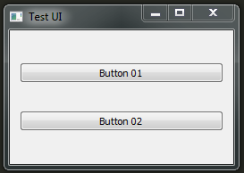

Getting Started
===============

The best way to learn how to use something is to get your hands dirty so we are
going to be using `introspeqt` by using it.

Creating a simple Application
-----------------------------

In order to explain what `introspeqt` is and how we can use it, we will need
a working PySide application first. Here is an example:

.. code-block:: python

    import sys
    from PySide import QtGui

    class Example(QtGui.QWidget):

        def __init__(self):
            super(Example, self).__init__()

            self.initUI()

        def initUI(self):

            self.setGeometry(300, 200, 250, 150)
            self.setWindowTitle('Test UI')

            layout = QtGui.QVBoxLayout()

            btn01 = QtGui.QPushButton('Button 01')
            btn02 = QtGui.QPushButton('Button 02')
            btn01.setObjectName('btn01')
            btn02.setObjectName('btn02')

            layout.addWidget(btn01)
            layout.addWidget(btn02)
            self.setLayout(layout)

            self.show()

    def main():

        app = QtGui.QApplication(sys.argv)
        ex = Example()
        sys.exit(app.exec_())

    if __name__ == '__main__':
        main()